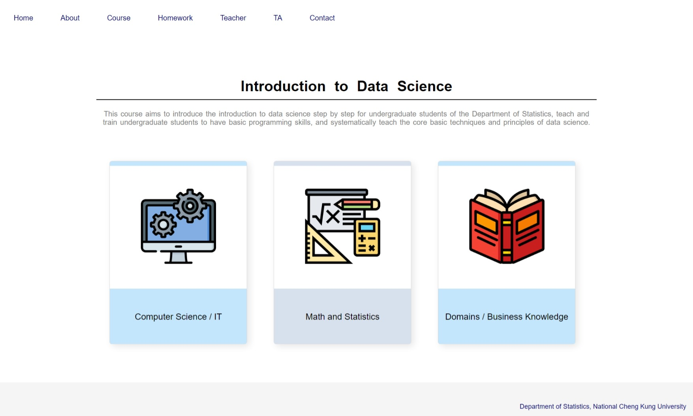

# HTML & CSS
## Introduction
HTML is the standard markup language for web pages.  
CSS describes how HTML elements should be displayed.  

In the end, we will teach you how to use HTML and CSS to implement a website, which use Visual Studio Code (VS Code) as our code editor.

## Contents
- HTML
  > `Basic`, `Headings`, `Paragraphs`, `Attributes`, `Formatting`, `Comments`, `Tables`, `Lists`, `Block & Inline`, `Forms`, `Classes`, and `Emojis`
- CSS
  > `Syntax`, `Selectors`, `Comments`, `Colors`, `Backgrounds`, `Height & Width`, `Box Model`, `Padding`, `Borders`, `Margins`, `Outline`, `Text`, `Fonts`, `Icons`, `Display`, `Position`, `Overflow`, `Float & Clear`, `Inline-block`, `Align`, `Pseudo-classes & Pseudo-element` and `Navigation Bar & Dropdown`
- Do it
  > `VS Code`, and `DevTools`
- Demo
  <kbd></kbd>
