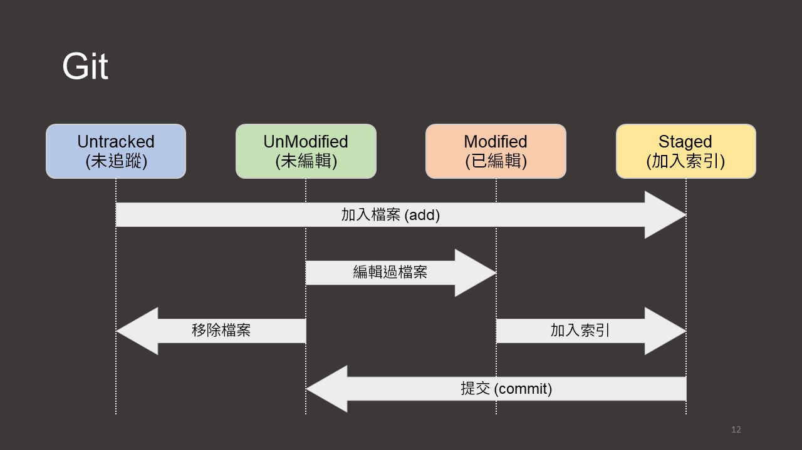

# Git & GitHub
## Introduction
Git is a free and open source distributed version control system designed to handle everything from small to very large projects with speed and efficiency.  
GitHub is a complete developer platform to build, scale, and deliver secure software.  

## Contents
- Git
  > `config`, `init`, `add`, `commit`, `log`, `status`, `remote`, `push`, `checkout`, `branch`, `merge`, `clone`, `fetch`, `pull`, `clean`, and `reset`.
    
  <kbd></kbd>

  <kbd></kbd>
- GitHub
  > `repository`, `page`, and `SSH`.

